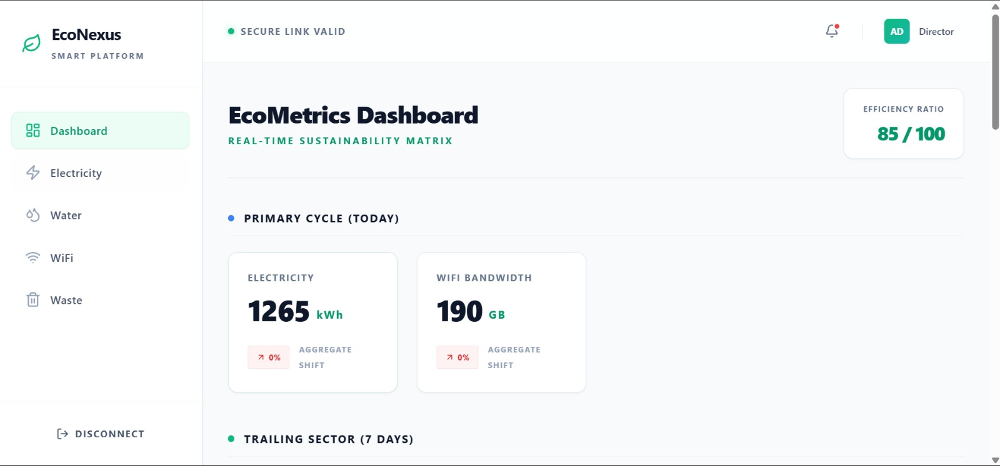
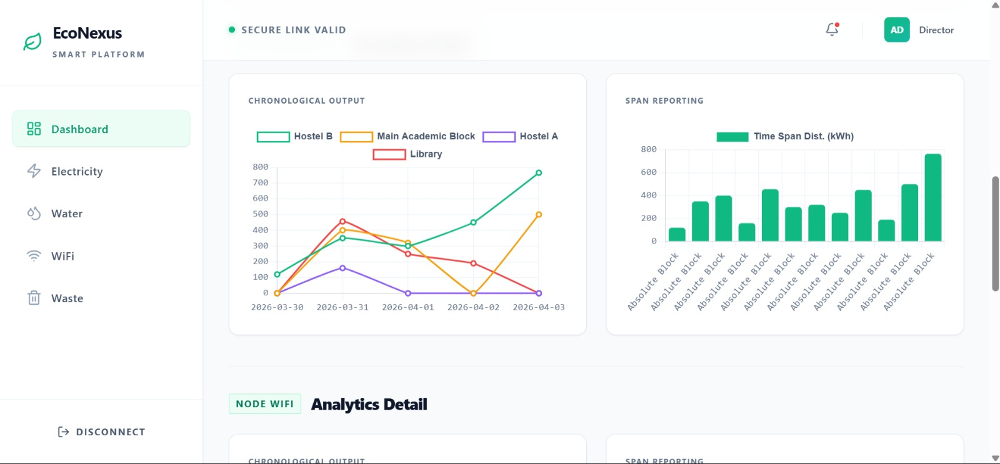

# 🌿 EcoNexus — Smart City Resource Intelligence Platform

> Turning resource data into actionable intelligence for smarter and sustainable environments 🚀

EcoNexus is a **Data Analytics + Full Stack Development project** built to monitor, analyze, and predict resource consumption across smart campuses, colleges, and organizations.

---

## ⚡ Resources Tracked

* ⚡ Electricity Usage
* 💧 Water Consumption
* 🌐 WiFi Bandwidth
* ♻️ Waste Generation

---

## ✨ Key Features

✅ Real-time sustainability dashboard
✅ Historical trend analysis
✅ Machine learning prediction
✅ Anomaly detection
✅ Efficiency scoring
✅ Smart recommendations

---

## 🧠 Tech Stack

### 🎨 Frontend

* React
* Tailwind CSS

### ⚙️ Backend

* Node.js
* Express.js

### 🗄️ Database

* MongoDB

### 📈 Analytics

* Python
* Pandas
* Scikit-learn

---

## 🖥️ Project Screenshots

### 📌 Dashboard Overview

### ⚡ Electricity Analytics

### 📈 Historical Resource Analysis

---

## 🎯 Project Goal

To build an intelligent platform that helps optimize resource usage using analytics and predictive modeling.

---

## 🤝 Contributor

* [Contributor Name]

---

## 🚀 Future Scope

* Live IoT integration
* Smart alerts
* Advanced forecasting
* Sustainability benchmarking
